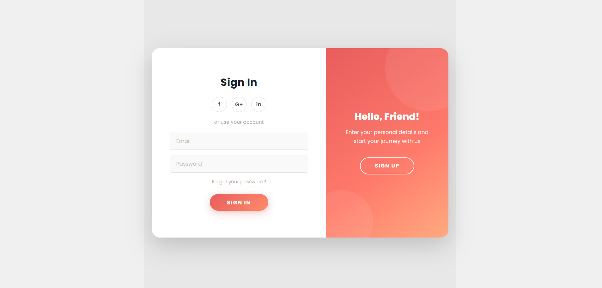
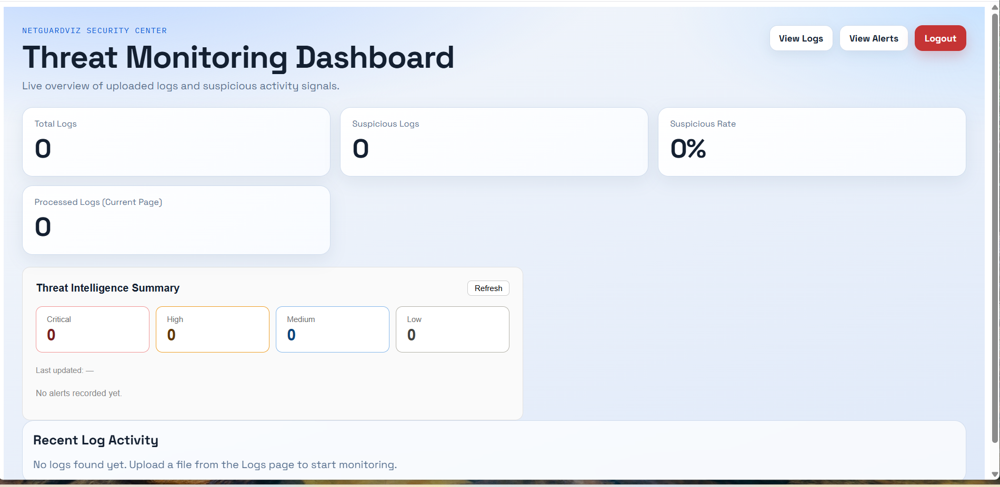
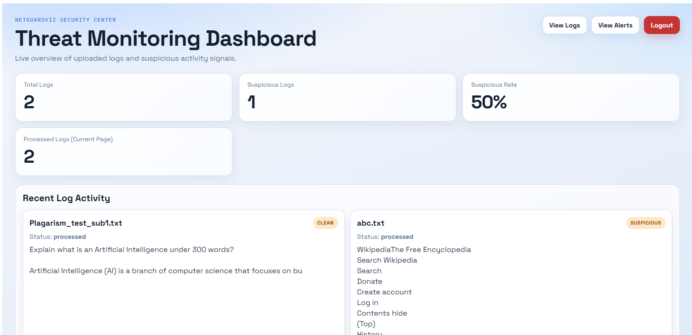
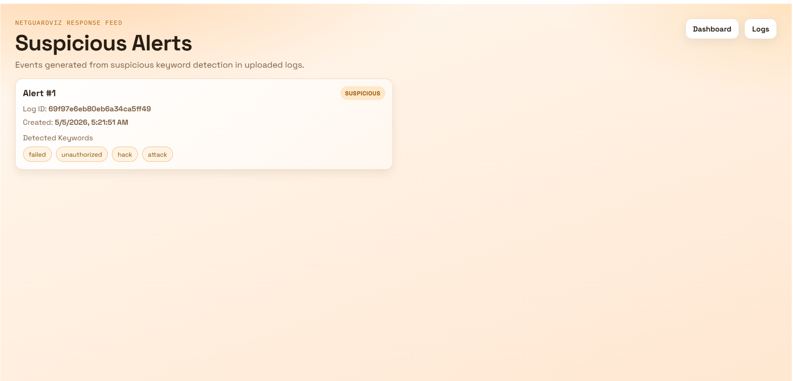
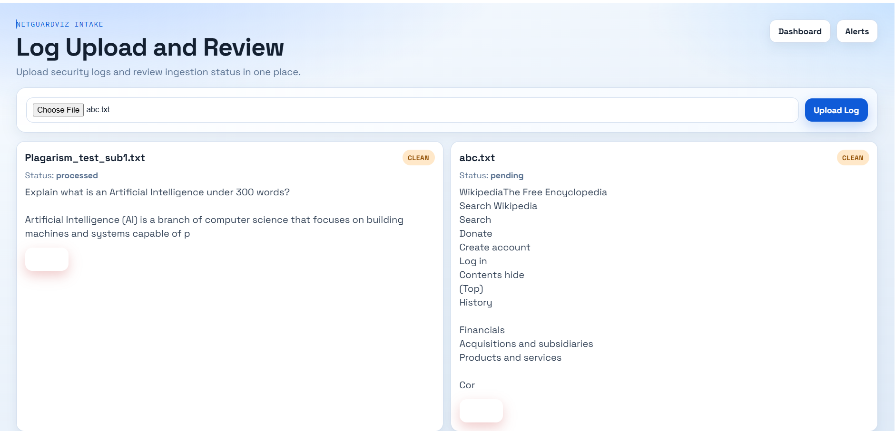

# 🛡️ NetGuardViz

**Real-time network monitoring and security visualization platform** — detecting port scans, ARP spoofing, cleartext credential exposure, and malicious IP connections, with live threat intelligence and a SIEM-style alert dashboard.

[](https://net-guard-viz.vercel.app)
[](https://netguardviz-api.onrender.com/docs)


---

## 🔗 Live Links

| Resource | URL |
|---|---|
| 🌐 Live Dashboard | [net-guard-viz.vercel.app](https://net-guard-viz.vercel.app) |
| 📘 API Documentation (Swagger) | [netguardviz-api.onrender.com/docs](https://netguardviz-api.onrender.com/docs) |
| 💻 Source Code | [github.com/ASura12/NetGuardViz](https://github.com/ASura12/NetGuardViz) |

---

## 📖 Overview

NetGuardViz is a full-stack security monitoring system that combines **live packet inspection**, **threat intelligence**, and **SIEM-style alert correlation** into a single dashboard. It was built to simulate how real Network Detection & Response (NDR) tools work — a lightweight local sensor captures and analyzes traffic, while a cloud-hosted backend and dashboard handle authentication, alert storage, and visualization.

> **Architecture note:** Like commercial NDR tools (e.g. on-prem sensors reporting to a cloud SIEM), the packet-capture engine runs as a local agent on the network being monitored — cloud containers don't have raw access to external network traffic. The deployed dashboard, API, and threat-intel layer are fully live; packet capture is demoed locally and alerts are synced to the same cloud database.

---

## ✨ Features

### 🔍 Detection Engine
- **Port scan detection** — configurable threshold (default: 15 unique ports / 60s window) with alert-deduplication cooldown to prevent alert flooding
- **ARP spoofing detection** — flags IP-to-MAC binding changes indicative of man-in-the-middle attempts
- **Cleartext credential detection** — flags HTTP Basic Auth and FTP credentials sent unencrypted

### 🌐 Threat Intelligence
- Live IP reputation checks via the **AbuseIPDB** API, with LRU caching to minimize redundant lookups
- **Automatic login-time IP scanning** — every authentication event is cross-referenced against known malicious IP databases in real time

### 🚨 SIEM-Style Alert Engine
- Severity-scored alerts (Low / Medium / High / Critical)
- **Multi-vector correlation** — flags source IPs triggering more than one distinct attack type
- Persistent storage in **MongoDB Atlas**, surviving deployments and restarts

### 🔐 Auth & Access Control
- JWT-based authentication
- Role-based access control (Admin / User)
- Protected API routes and dashboard views

### 📊 Live Dashboard
- Real-time alert summary and severity breakdown
- Log upload and review
- Admin panel for user management

---

## 🏗️ Architecture

```
┌─────────────────┐        ┌──────────────────┐        ┌─────────────────┐
│  Local Machine   │        │   Cloud Backend   │        │  Cloud Frontend  │
│                  │        │   (Render)        │        │   (Vercel)       │
│  capture.py      │───────▶│   FastAPI         │◀──────▶│   React + Vite   │
│  (Scapy sniffer) │  writes│   - Auth (JWT)    │  reads │   Dashboard      │
│  - Port scan     │ alerts │   - Threat Intel  │ alerts │   - Live alerts  │
│  - ARP spoof     │        │   - SIEM Engine   │        │   - Log viewer   │
│  - Cleartext     │        │                   │        │   - Admin panel  │
└─────────────────┘        └─────────┬─────────┘        └─────────────────┘
                                      │
                                      ▼
                            ┌───────────────────┐
                            │   MongoDB Atlas    │
                            │  (users, logs,     │
                            │   alerts)          │
                            └───────────────────┘
```

---

## 🛠️ Tech Stack

| Layer | Technology |
|---|---|
| **Backend** | FastAPI, Python 3.11 |
| **Frontend** | React, Vite |
| **Database** | MongoDB Atlas |
| **Packet Analysis** | Scapy |
| **Threat Intel** | AbuseIPDB API |
| **Auth** | JWT (python-jose), Passlib (bcrypt) |
| **Deployment** | Render (backend), Vercel (frontend) |

---

## 📸 Screenshots

<table>
  <tr>
    <td></td>
    <td></td>
  </tr>
  <tr>
    <td></td>
    <td></td>
  </tr>
  <tr>
    <td></td>
    <td></td>
  </tr>
</table>

---

## 🚀 Getting Started (Local Development)

### Prerequisites
- Python 3.11+
- Node.js 18+
- MongoDB Atlas account (or local MongoDB instance)
- [Npcap](https://npcap.com) (Windows only, required for Scapy packet capture)
- Nmap (for testing detection features)

### Backend Setup

```bash
git clone https://github.com/ASura12/NetGuardViz.git
cd NetGuardViz

python -m venv .venv
.venv\Scripts\activate        # Windows
source .venv/bin/activate     # macOS/Linux

pip install -r requirements.txt
```

Create a `.env` file in the project root:
```env
JWT_SECRET=your_jwt_secret
JWT_EXPIRE_MINUTES=30
MONGODB_URI=your_mongodb_connection_string
MONGODB_DB_NAME=netguardviz_db
ABUSEIPDB_API_KEY=your_abuseipdb_key
```

Run the backend:
```bash
uvicorn app.main:app --reload
```

### Frontend Setup

```bash
cd frontend
npm install
npm run dev
```

### Running the Packet Capture Agent (Local Only)

```bash
# Run as Administrator / with sudo — required for raw socket access
python -m app.capture
```

Test detection by running a scan against yourself:
```bash
nmap -sS <your_local_ip>
```

---

## 📡 API Endpoints

| Method | Endpoint | Description |
|---|---|---|
| `POST` | `/auth/signup` | Register a new user |
| `POST` | `/auth/login` | Authenticate and receive a JWT (includes automatic login IP threat check) |
| `GET` | `/api/logs/` | Retrieve uploaded logs |
| `POST` | `/api/logs/upload` | Upload a log file for analysis |
| `GET` | `/api/alerts/` | Retrieve suspicious activity alerts |
| `GET` | `/api/stats/` | Retrieve dashboard statistics |
| `GET` | `/api/threats/summary` | Get SIEM alert summary and severity breakdown |
| `GET` | `/api/threats/check/{ip}` | Check a specific IP against AbuseIPDB |

Full interactive documentation available at [`/docs`](https://netguardviz-api.onrender.com/docs).

---

## 🗺️ Roadmap

- [ ] WebSocket-based live alert streaming (replace polling)
- [ ] Configurable detection thresholds via the dashboard UI
- [ ] Email/SMS notifications for critical alerts
- [ ] Expanded threat intel sources (VirusTotal, Shodan)
- [ ] Historical alert analytics and trend charts

---

## 👤 Author

**Ashish Pathak**
[LinkedIn](https://linkedin.com/in/ashish-pathak-92669a287) • [GitHub](https://github.com/ASura12) • ashishpathak1205@gmail.com

---

## 📄 License

This project is licensed under the MIT License.
